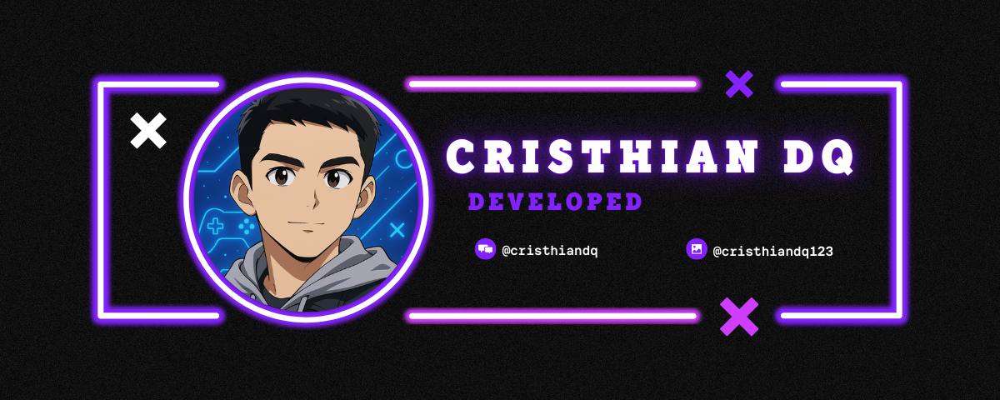

## Holaa!! Bienvenid@s es grato tenerlos aqui!! 👋 

#  

👩‍💻 ¡Mi nombre es Cristhian! 🚀

Soy estudiante de **Ingeniería de Sistemas**, apasionado por la tecnología, el desarrollo de software y la resolución creativa de problemas. Aquí encontrarás algunos de los proyectos, experimentos y retos que forman parte de mi viaje como futuro ingeniero 💻✨

---

## 🧠 Sobre mí

- 🎓 Estudiante de Ingeniería de Sistemas | Universidad Continental Sede Cusco
- 💡 Apasionada por el desarrollo web, la inteligencia artificial y la automatización
- 🌱 Actualmente aprendiendo: Docker, DevOps, y Deep Learning
- 🛠️ Tecnologías favoritas: Python, JavaScript, Node.js, React, MySQL
- 📚 Siempre en busca de nuevos retos y conocimientos

---

## 📁 Repositorios Destacados

| Proyecto | Descripción | Tecnologías |
|---------|-------------|-------------|
| 📊 `sistema-notas` | App web para gestionar calificaciones académicas | HTML, CSS, JS, PHP, MySQL |
| 🤖 `chatbot-universitario` | Bot para responder preguntas frecuentes de estudiantes | Python, Flask, Dialogflow |
| 📱 `app-movilidad-urbana` | Prototipo de app para rutas inteligentes en la ciudad | Kotlin, Firebase, Google Maps API |

👉 *Revisa mis pinned repositories para ver más proyectos interesantes.*

---

## 🚀 Habilidades Técnicas
### Skills

